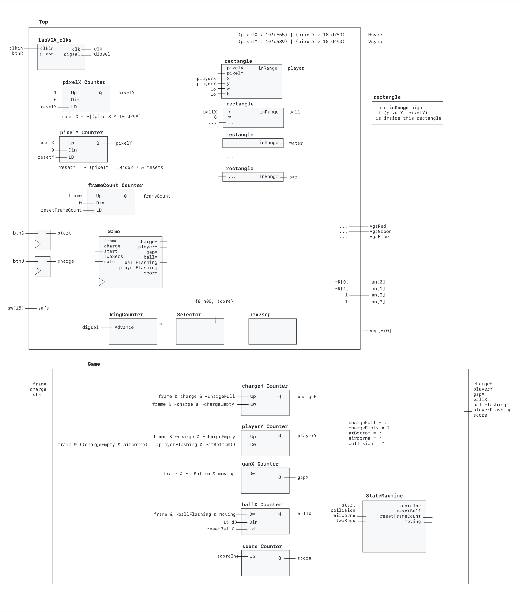
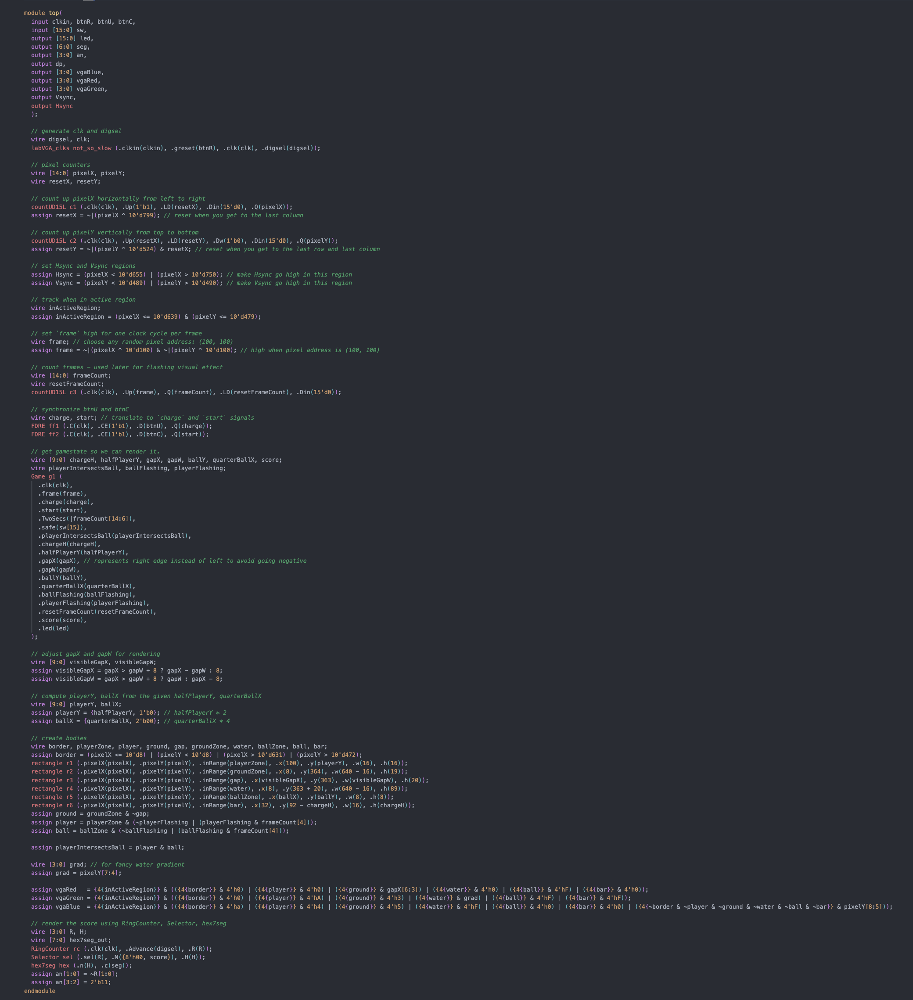

# Lab 6 Writeup
- James Tennant
- 2 December 2022
- Section A

## Description

In Lab 6 I designed and implemented a version of the game "Watch Your Step Keeper" using the BASYS3 board and the VGA monitor connected to it. In this game a player tries to tag yellow balls travelling across the screen above by jumping up. They must also jump up to avoid falling through holes in the platform.

## Design

<table>
<tr>
<th>Component</th><th>Description</th>
</td>
</tr>
<tr>
<td>

`top`
</td>
<td>

This is the only component with access to external inputs and external outputs. This top-level component is responsible for managing and connecting all of the other subcomponents. For all other details see the full top-level diagram below.

</td>
</tr>
<tr>
<td>

`labVGA_clks`
</td>
<td>

Provided. Generates `clk` and `digsel`.

</td>
</tr>
<tr>
<td>

`pixelX_Counter`
</td>
<td>

Records and increments `pixelX`, the x-coordinite of the pixel being painted.

</td>
</tr>
<tr>
<tr>
<td>

`pixelY_Counter`
</td>
<td>

Records and increments `pixelY`, the y-coordinite of the pixel being painted.

</td>
</tr>
<tr>
<td>

`frameCount`
</td>
<td>

A counter for `frameCount`, which is used for flashing effect.

</td>
</tr>
<tr>
<td>

`rectangle`
</td>
<td>

This module is provided with the pixel coordinate (`pixelX`, `pixelY`) in addition to the posiiton, width, and height (`x`, `y`, `w`, `h`) of a rectangluar region on the monitor. `inRange` is set high when (`pixelX`, `pixelY`) is inside this rectangle.

</td>
</tr>
<tr>
<td>

`Game`
</td>
<td>

This module is responsible for managing the gamestate variables:
(`chargeH`, `playerY`, `gapX`, `ballX`, `ballFlashing`, `playerFlashing`, `score`). All possbile gamestates are made from all possible combinations of these variables. For more detials see the `Game` diagram below. 

</td>
</tr>
<tr><td>

`RingCounter`</td><td>Taken directly from Lab 2.</td>
</tr>
<tr><td>

`Selector`</td><td>Taken directly from Lab 2.</td>
</tr>
<tr><td>

`hex7seg`</td><td>Taken directly from Lab 2.</td>
</tr>
<table>

## Testing & Simulation
Before anything else, I spent much time coming up with my state diagram for `StateMachine`. I went through several iterations of my state diagram, but was very satisfied with my final version. Then, using one-hot encoding, I carefully implemented `StateMachine`. Then I simulated `StateMachine` with all the cases I could think of, and to my suprise, *everything worked as expected, first try, without any adjustments at all*. Even though I ultimatley did not change anything, I was glad to confirm that my StateMachine appeared to have nearly perfect functionality. At the top level, through simulating I discovered that my original logic for setting `Match` was flawed — I was using the negation operator `~` as if it were a reduction operator.

## Results
> Include your state diagram, next state and output logic equations. The diagram can be hand drawn or drawn using with a program(aka app).

See appendix for my state diagram, next state and output logic equations.

## Conclusion
Compared to previous labs, this lab allowed for more creative liberty. There were many different ways to build this lab, and none of them were obviously the "right" or best way. Therefore I really had to make executive decisions and come up with my own logic, without following a predefined path.

This lab went very smoothley, didn't take very long, and was not very painful. I am grateful to have not encountered hardly any bugs or obstacles. I wouldn't do anything differently if I were to do it over again.

## Appendix

*My original state diagram, next state logic equations (using one-hot encoding), and output logic equations.*

*Code for my top-level module*

