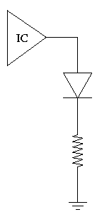
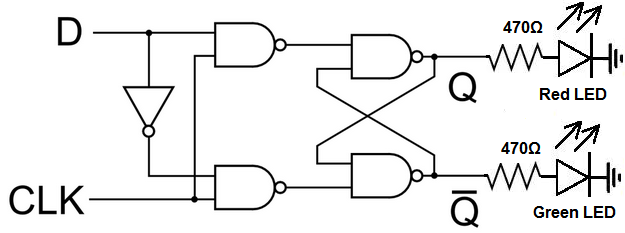
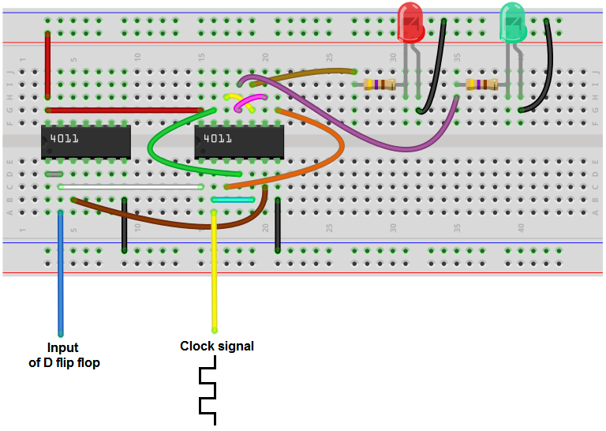

# Lab 7 Writeup
- James Tennant
- 8 December 2022
- Section A

## Description

Lab 7 had two goals:

1. Create a ring oscillator using $9$ inverters.
2. Construct an edge triggered flip-flop.

## Design

<table>
  <tr>
  <td>

$\text{Part I}$

  </td>
  <td>

To create a ring oscillator using $9$ inverters, I fed a charge through $9$
inverters using a breadboard and wires.

My kit has two chips with inverters, each with $6$ inverters. So I needed to
use both chips.

See [appendix](#appendix) for logic network and wiring diagram.

  </td>
  </tr>

  <tr>
  <td>

$\text{Part II}$  

  </td>
  <td>

My edge-triggered flip-flop has two 1-bit inputs:
- $D$
- $\text{Clock}$

And two 1-bit outputs:
- $Q$
- $\overline{Q}$

I decided to create a positive-edge triggered flip-flop using $6$ NAND gates,
much like the design shown in lecture.

See [appendix](#appendix) for logic network and wiring diagram.

  </td>
  </tr>
<table>

## Testing & Simulation

Before doing anything, I plugged in my power supply and used my multimeter to
confirm that my power supply provided $5$ volts.

Then, because it was my first time using a breadboard, before beginning
$\text{Part I}$, I decided to simply see if I could illuminate one of my LEDs
like so:

At first, the LED was not very bright. Therefore I decided to use less
resistance until the LED was sufficiently bright.

Now that I had created my first breadboard circuit to illuminate my LED and
decided on the appropriate resistance needed for my LEDs, I began working on
$\text{Part I}$ and $\text{Part II}$. I used my multimeter to debug.

## Results

I measured propagation delay in $\text{Part I}$. Acorrding to the
[data sheet](https://www.ti.com/product/SN74S04) for the inverter, the
propagation delay of the inverters should be $4.75$ nanoseconds. Using my
oscilloscope, I observed a propagation delay of ~$4.4$ nanoseconds, which
seemed reasonable.

In $\text{Part II}$ my flip-flop worked as expected — $Q$ is updated to the
value of $D$ when $\text{Clock}$ goes high, and $\overline{Q}$ is always the
inverse of $Q$.

## Conclusion
What did you learn from the lab? Did you have any difficulties? If you could do
this lab again, what would you do differently? Are there components you would
optimize?

I learned the basics of creating circuits with breadboards, which was a fun
first-time experience. My biggest difficulty came from a small mistake:
forgetting to ground my NAND chips in $\text{Part II}$. If I were to do this
lab again, I can't say I would do much differently.

## Appendix

My logic network for $\text{Part II}$
 

My wireing diagram for $\text{Part II}$
